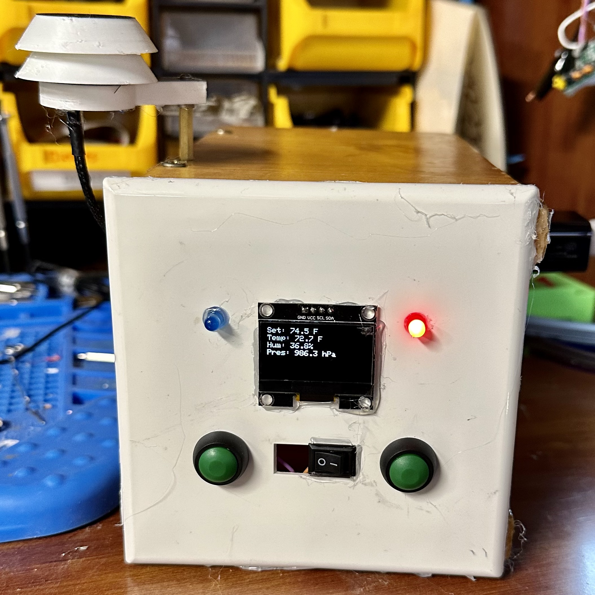
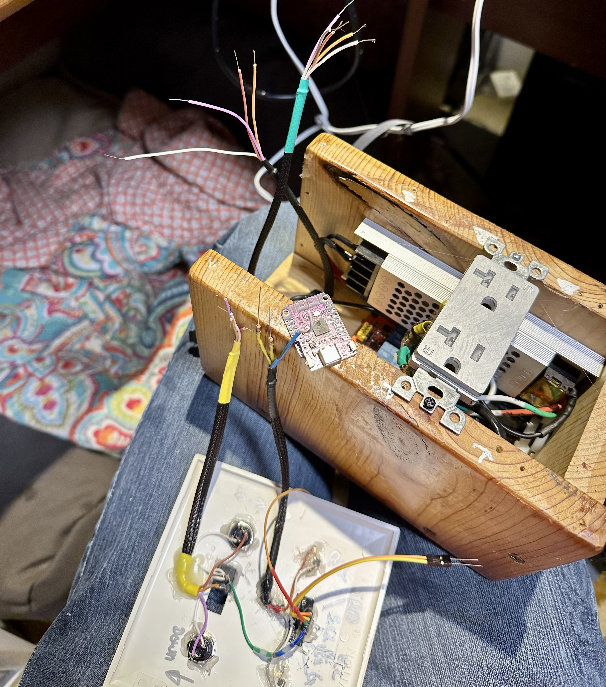
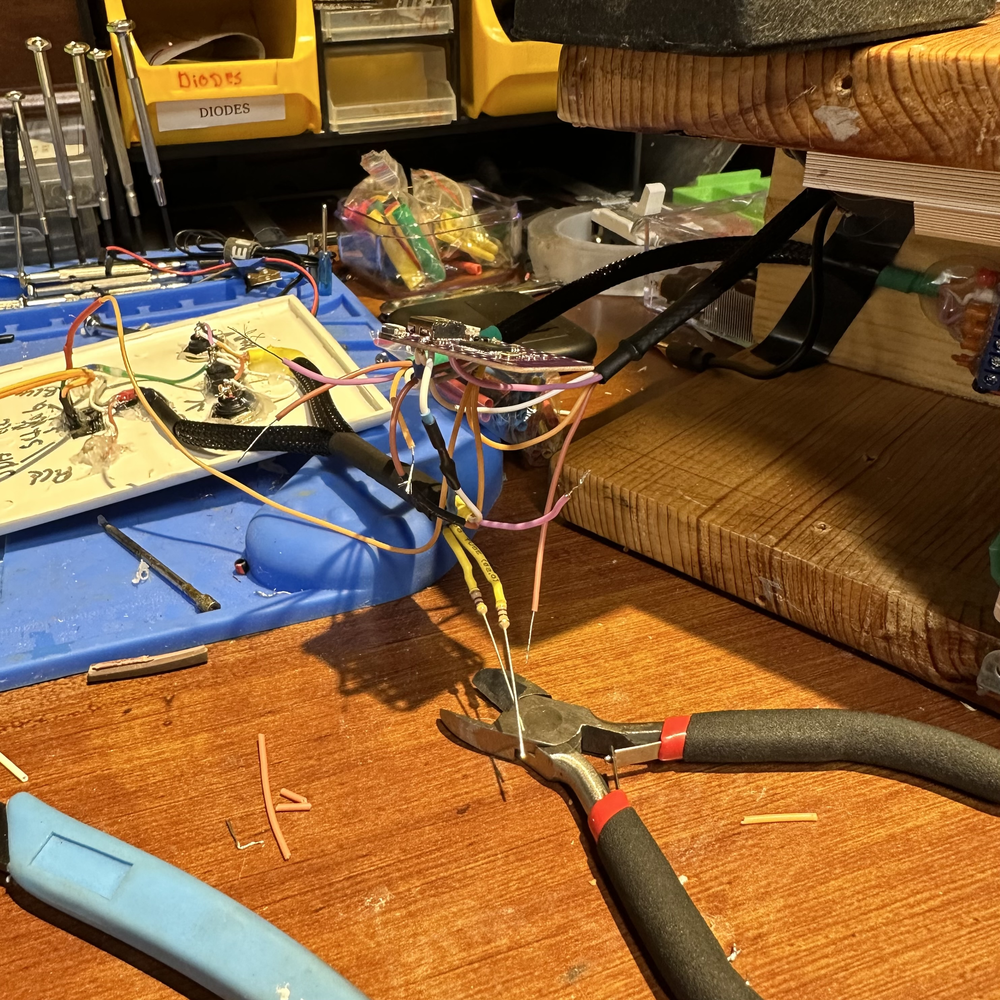
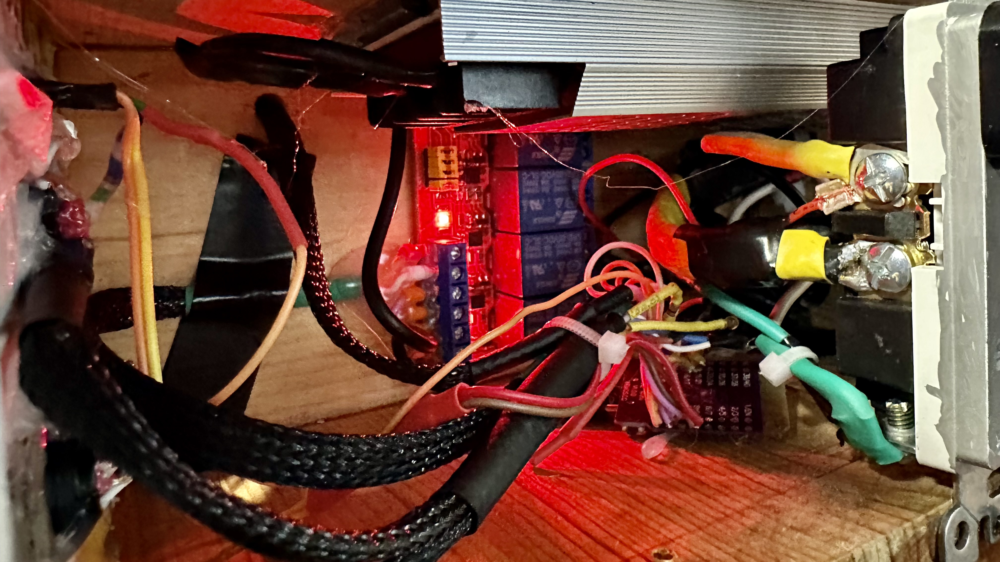
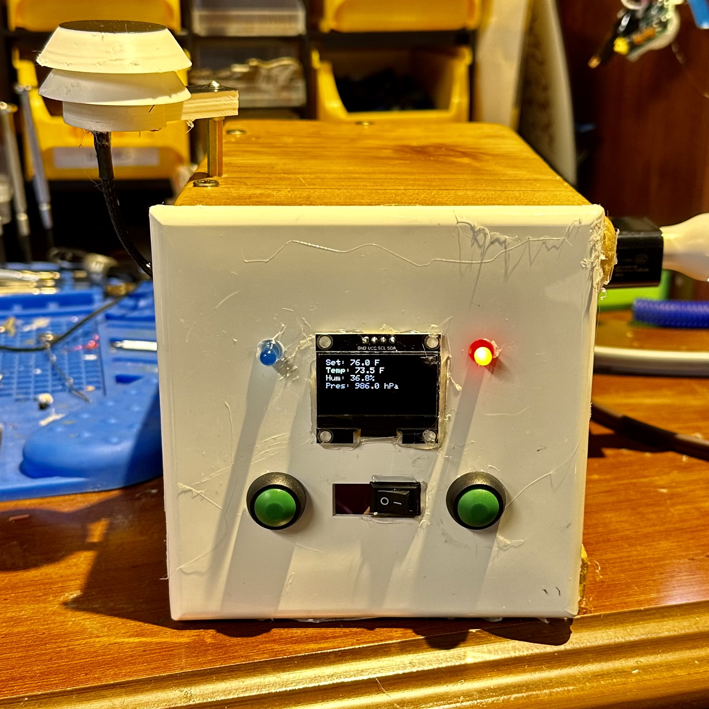
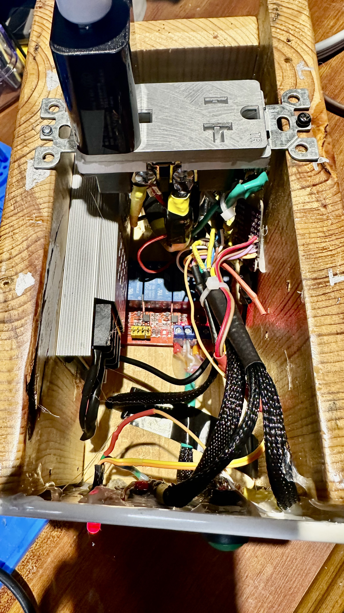

# Thermostat for Plug-in Heater

This repository contains the code and documentation for a custom-built thermostat designed to control plug-in heaters. The thermostat uses dual 10A relays setup in parallel to handle up to 20A of current, making it suitable for high-power applications such as heating a home greenhouse.

*Inside wooden enclosure*

## Features

- **Temperature Control**: Utilizes a BME280 sensor for accurate temperature readings.
- **Relay Handling**: Controls dual 2-10A relays in parallel for high-current handling.
- **Safety**: Designed with safety in mind to handle the electrical loads of household heating appliances.
- **Ease of Use**: Simple button interface for adjusting temperature setpoints.
- **Display**: Incorporates an SH1106 OLED display for real-time temperature, humidity, and pressure readouts.
- **OTA Updates**: Supports Over-The-Air (OTA) updates for easy firmware upgrades.

## Hardware Components

- ESP32-S2 Mini for the main microcontroller and WiFi capabilities
- BME280 sensor for temperature, humidity, and atmospheric pressure measurements
- SH1106 OLED display for real-time feedback
- HiLetGo 4-channel relay module, 2 channels in use
- Standard 20A outlet to plug in the heater
- 120V to 5V converter (retrieved from a USB charging block) to power the ESP32-S2 Mini
- 12V to 12V, 60W transformer providing constant 12V output
- DC barrel plug for the 12V output connection
- Buttons for user input to adjust the temperature setpoint
- LEDs to indicate the status of the relay

## Wiring Guide

Here's a guide on how to wire the components for the `Thermostat_for_Plug-in_Heater` project:

**pin numbers**:can be found in the .INO project file.

**Remember you need to tie the GND lines together, and the 3.3V vcc too... The esp32 S2 Mini only has 2 GND Pins and 1 3.3V pin!**

- **Plug IN**: Get a high power short APLIANCE or HEAVY DUTY EXT cord with a 3 prong plug, cut in half and use male plug in side for AC power in to unit. (For safety use 20A In Line fuse on HOT line)

### ESP32-S2 Mini
- **5V Power**: Connect the 5V USB output from a charging block to ESP32 with a usb-c cable.

### BME280 Sensor
- **VCC**: Connect to a 3.3V pin on the ESP32-S2 Mini. (Rember to tie tigether with display VCC)
- **GND**: Connect to a GND pin. (Rember to tie tigether with other GND wires)
- **SDA**: Connect to GPIO 8 (SDA). (both bme and display get wired to same 2 pins, combine SDA and SCL lines on both before soldering)
- **SCL**: Connect to GPIO 9 (SCL).

### SH1106 OLED Display
- **VCC**: Connect to a 3.3V pin on the ESP32-S2 Mini.
- **GND**: Connect to a GND pin.
- **SDA**: Connect to GPIO 8 (SDA), shared with the BME280 sensor.
- **SCL**: Connect to GPIO 9 (SCL), shared with the BME280 sensor.

### Relay Module (HiLetGo 4-channel)
- **VCC**: Connect to the VCC (5v) output from the ESP-32 S2 Mini.
- **IN1 and IN2**: Connect to the same GPIO pin on the ESP32-S2 Mini for relay control.
- **GND**: Combine wire with other GND wires. Connect to GND on ESP32. 
- **COM terminals of Relay 1 and Relay 2**: Bridge these terminals together with a short 12 to 16 AWG wire. Strip one end first, then grasp the insulator near the exposed wire, put your wire strippers directly in the center and pull to expose a small section of wire, but do not remove the rest of the insulation yet. next move to the remaining side of the wire that is not exposed yet and grasp just passed the middle exposed wire, and use your wire strippers to expose the wire on that side as well. After that if you are able to connect your jumper into both COM of relay 1 & 2 and use a 12 AWG wire, or thicker to then connect to 120v Load IN.
  
- **NO terminals of Relay 1 and Relay 2**: After repeating the same process above to create another jumper wire
bridge these terminals together and then connect to the HOT or LOAD side of the 120V plug.
- **Nutreal power line**: Connect to Nutreal leg of 12v plug, use 2nd plug termnial to porvide Nutreal to USB power block and 12V transformer if being included. DO NOT connect to relay.
- **Add Cooling Function**: Connect 2nd 120v Plug hot leg to NC of relay and Nutreal leg of 2nd plug to exisitng nutreal line (all Nutreals get tied together, remember to ground the plug from your power plug cable)
- that will enable a second plug-in to be triggered opposite of the heat plug, for a window unit, fan, or whatever your heart desires that runs on 120 V and is less than 20 A 

### Buttons
- **Increase Setpoint**: Connect one side to GPIO 14 and the other side to GND cluster.
- **Decrease Setpoint**: Connect one side to GPIO 12 and the other side to GND cluster.
- **Setpoint Adjustment Mode**: Connect one side to GPIO 10 and the other side to GND. 
- Tip - I connected the GND from this switch to the ground of everything on the face plate. To explain in more detail, I connected the grounds for the up and down buttons, the screen and the LEDs to the setpoint mode switch COM leg, allowing me to only run one wire from setpoint mode switch on the the face plate for GND to the esp32. I highly recommended doing this because there are already plenty of wires, containing them in a wire, loom or plain old tape definitely helps, but make sure you can keep which one is which clearly labled. -kiasarecool
  

### LEDs
- **"Relay On" LED**: Connect the anode (longer leg) to a GPIO and the cathode (shorter leg) to GND through a resistor (e.g., 330Ω).
- **"Relay Off" LED**: Connect similarly to another GPIO.

Remember to follow all safety precautions when working with electricity, especially mains voltages. It is recommended that mains electricity connections be handled by a qualified electrician, or a brave USA homeowner that understands the risks, since that is legal here. The relay connections to the 120V plug should be insulated properly and secured within an appropriate enclosure.

make sure your donor extension cord can handle 20 A at the minimum recommended would be at least 25 A

You can figure this yourself using the standard amp versus distance wire gauge chart. I'm not responsible if you burn something down by using wires that can't handle the power. 

## Setup and Usage

1. **Flash the Firmware**: Upload the code from this repository to the ESP32-S2 using the Arduino IDE.
2. **Configure WiFi**: Set your WiFi credentials in the code to enable OTA updates.
3. **Adjust Setpoint**: Use the button interface to adjust the temperature setpoint to your desired level.
4. **Monitor**: The OLED display will show the current temperature, setpoint, humidity, and pressure.
5. **OTA Updates**: When updates are available, use the Arduino IDE to upload new firmware wirelessly.

## OTA Updates

The ESP32-S2 Mini supports OTA updates. To update your thermostat firmware:

1. Choose the network port associated with the device in the Arduino IDE.
2. Upload the sketch normally; the IDE will handle the OTA update process.

Ensure that the device is on and connected to the same network as your computer during the update process.

## Image Gallery

Here are some images of the `Thermostat_for_Plug-in_Heater` project setup and components:

*Thermostat Wiring Overview*

*Wiring Detail*

*Relay Module Wiring*

*Completed Assembly Front*

*Completed Assembly side/ inside *

Please note that these images are for reference only. Ensure all connections are secure and follow safety standards when replicating this project.
## Contributing

Contributions to the `Thermostat_for_Plug-in_Heater` project are welcome. Please fork this repository and submit pull requests with your improvements.

## Acknowledgments

- Thanks to the open-source community for the support and tools that made this project possible.
- Special thanks to Adafruit for providing the libraries for the ESP32, BME280 sensor, and SH1106 display.
